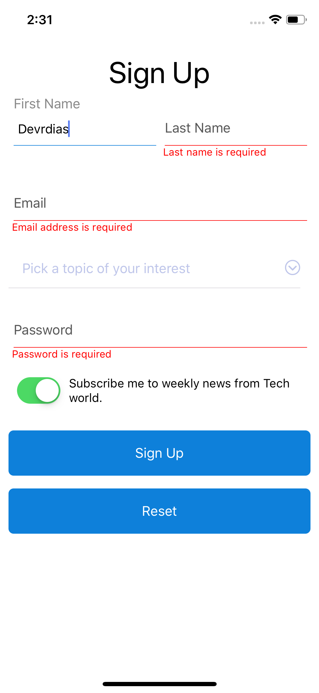

# REACT NATIVE CUSTOM FORM

A React Native component which works like a Form Builder.

I first started this project to help myself on personal projects and for learning purposes, but them it turned out that maybe it can help others to build apps using this simple, light and fast Form Builder.

Uses **React Hooks** just to demonstrate this new fabulous feature of React.

To dynamic build a form, simple declare an array of fields as shown below.
Use same default properties from RN Components Library, sucha as **TextIput**, **Button**, **TouchableOpacity**.

---

## Example

<p align="center">
  
  
  
</p>

---

### 1. Defining Fields [See file definition here](/src/screens/SignUp/SignUpFields.js)

```javascript
const fields = [
  [
    {
      name: "firstName",
      label: "First Name",
      type: "input",
      inputProps: {
        autoCorrect: false
      }
    },
    {
      name: "lastName",
      label: "Last Name",
      type: "input",
      inputProps: {
        autoCorrect: false
      }
    }
  ],
  [
    {
      name: "email",
      label: "Email",
      type: "input",
      inputProps: {
        autoCorrect: false,
        autoCapitalize: "none",
        keyboardType: "email-address"
      }
    }
  ],
  [
    {
      name: "subject",
      placeholder: "Pick a topic of your interest",
      pickerItems: [
        {
          label: "React Native",
          value: 0
        },
        {
          label: "React Hooks",
          value: 1
        },
        {
          label: "React Navigation",
          value: 2
        },
        {
          label: "React News",
          value: 3
        }
      ],
      type: "picker"
    }
  ],
  [
    {
      name: "password",
      label: "Password",
      type: "input",
      inputProps: {
        secureTextEntry: true
      }
    }
  ],
  [
    {
      name: "subscribe",
      label: "Subscribe me to weekly news from Tech world.",
      type: "boolean",
      defaultValue: true
    }
  ],
  [
    {
      name: "signUpButton",
      label: "Sign Up",
      type: "button"
    }
  ],
  [
    {
      name: "resetButton",
      label: "Reset",
      type: "button"
    }
  ]
];
```

### 2. Defining form validation rules by field [See file definition here](/src/screens/SignUp/SignUpFormValidationRules.js)

```javascript
const validate = ({ firstName, lastName, email, subject, password }) => {
  const errors = {};

  if (!firstName.value) {
    errors.firstName = "First name is required";
  }
  if (!lastName.value) {
    errors.lastName = "Last name is required";
  }

  if (!email.value) {
    errors.email = "Email address is required";
  } else if (!/\S+@\S+\.\S+/.test(email.value)) {
    errors.email = "Email address is invalid";
  }

  if (!subject.value) {
    errors.subject = "A subject of interest is required.";
  }

  if (!password.value) {
    errors.password = "Password is required";
  }

  return errors;
};

export default validate;
```

### 3. Declaring callback to be executed after form submission/validation [See file definition here](/src/screens/SignUp/index.js)

```javascript
const handleSubmit = fields => {
  const { firstName, lastName, email, subject, password } = fields;

  Alert.alert(
    "Your info",
    `First Name: ${firstName.value}\n Last Name: ${lastName.value}\n Email: ${
      email.value
    }\n Subject: ${subject.value} \n Password: ${password.value}`
  );
};
```

### 4. Using the component [See file definition here](/src/screens/SignUp/index.js)

```JSX
<CustomForm
  formFieldsRows={fields}
  handleSubmit={handleSubmit}
  validation={validationRules}
/>
```

---

# BACKLOG

- [ ] refactor to use styled components
- [ ] Implement other field types
- [ ] Tests

---

## VERSION HISTORY

### 0.0.3

- [ x ] implement form validation with error messages

### 0.0.2

- [ x ] Implement custom form picker
- [ x ] Allows form to render any kind of React component
- [ x ] Added react-native-maked-text to allows masked input texts

---

## CONTRIBUTING

Any kind o help is appreciated, so please let's grow the community together.

If you would like to contribute whith this project somehow, please read
[CONTRIBUTING](CONTRIBUTING.md)

## License

This project is licensed under the MIT License.
